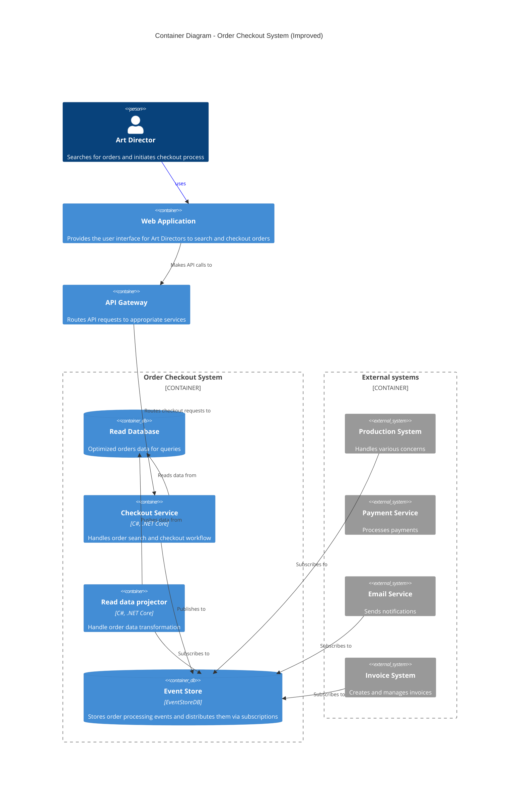

# 5. Building Block View

## 5.1. Container Diagram

```mermaid
C4Container
    title Container Diagram - Order Checkout System (Improved)

    Person(artDirectors, "Art Director", "Searches for orders and initiates checkout process")
    
    Container(webApp, "Web Application",, "Provides the user interface for Art Directors to search and checkout orders")
    Container(apiGateway, "API Gateway",, "Routes API requests to appropriate services")
    Container_Boundary(orderCheckoutSystem, "Order Checkout System") {
        ContainerDb(readModel, "Read Database",, "Optimized orders data for queries")
        Container(checkoutService, "Checkout Service", "C#, .NET Core", "Handles order search and checkout workflow")
        Container(readDataProjector, "Read data projector", "C#, .NET Core", "Handle order data transformation")
        ContainerDb(eventStore, "Event Store", "EventStoreDB", "Stores order processing events and distributes them via subscriptions")
    }

    Container_Boundary(externalsystems, "External systems") {
        System_Ext(productionSystem, "Production System", "Handles various concerns")
        System_Ext(paymentService, "Payment Service", "Processes payments")
        System_Ext(emailService, "Email Service", "Sends notifications")
        System_Ext(invoiceSystem, "Invoice System", "Creates and manages invoices")
    }
    
    Rel(artDirectors, webApp, "uses")
    
    Rel(webApp, apiGateway, "Makes API calls to")
    
    Rel(apiGateway, checkoutService, "Routes checkout requests to")
    
    Rel(checkoutService, eventStore, "Publishes to")

    Rel(productionSystem, eventStore, "Subscribes to")
    Rel(emailService, eventStore, "Subscribes to")
    Rel(invoiceSystem, eventStore, "Subscribes to")
    Rel(readDataProjector, eventStore, "Subscribes to")
    
    Rel(checkoutService, readModel, "Reads data from")
    Rel(readDataProjector, readModel, "Pushes data from")
    
    UpdateRelStyle(artDirectors, webApp, $textColor="blue", $lineColor="blue")
    UpdateRelStyle(eventStore, readModelProjector, $textColor="orange", $lineColor="orange")
```

## 5.2. Component Diagram

## 5.3. Code Diagram