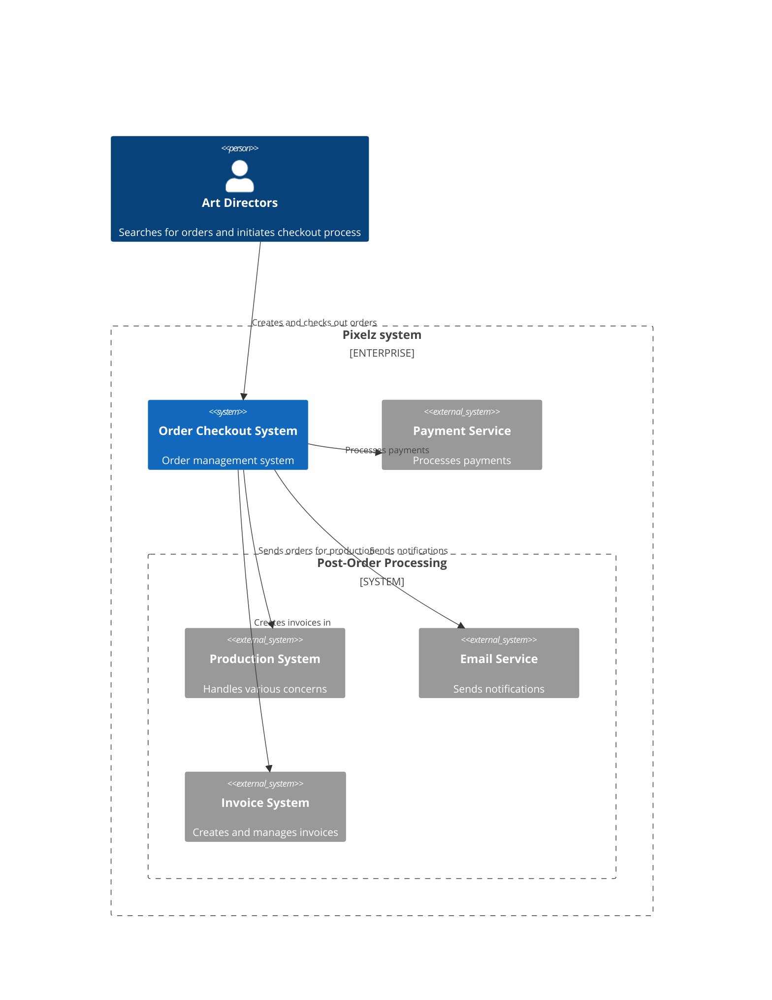

# 3. Context and Scope

## 3.1. Business context

The System Context diagram illustrates the high-level interactions between the Order Checkout System and its environment:

- **Art Directors** interact with the system to search for orders and initiate checkout processes
- **Order Checkout System** allows **Art Directors** to search, manage and checkout orders
- External systems the **Order Checkout System** integrates with:
    - **Payment Service**: Processes payment transactions
    - **Email Service**: Sends confirmation emails to clients
    - **Production System**: Internal system that actually manage the orders and their status
    - **Invoice System**: Creates and manages invoices

## 3.2. Technical context

**Order Checkout System** interacts with the following external systems

|System             | Description           | Protocol              |
|-------------------|-----------------------|-----------------------|
| Payment Service   | Payment processing    | REST API              |
| Invoice System    | Invoices management   | Event subscription    |
| Production System | Orders management     | Event subscription    |
| Email Service     | Notification system   | Event subscription    |