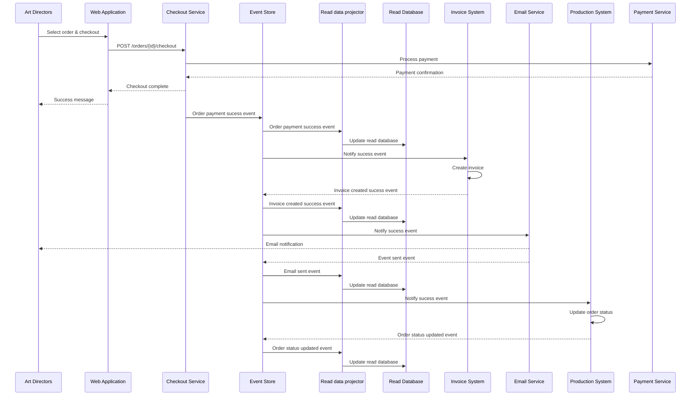
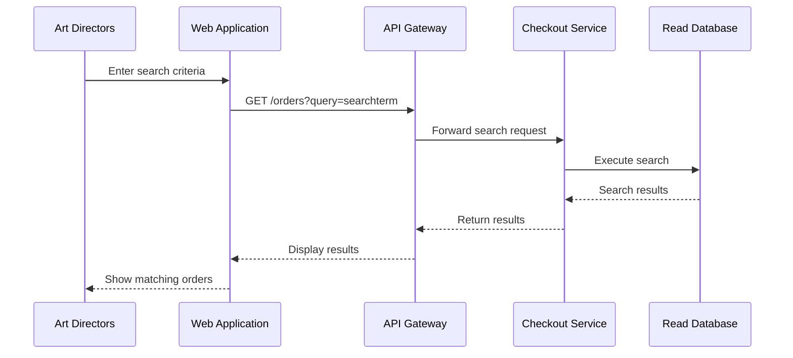

# 6. Runtime View

## 6.1. Order Checkout Process

```mermaid
sequenceDiagram
    participant User as Art Directors
    participant UI as Web Application
    participant OS as Checkout Service
    participant ES as Event Store
    participant RDP as Read data projector
    participant RD as Read Database
    participant IS as Invoice System
    participant NS as Email Service
    participant PS as Production System
    participant PG as Payment Service
    
    User->>UI: Select order & checkout
    UI->>OS: POST /orders/{id}/checkout
    OS->>PG: Process payment
    PG-->>OS: Payment confirmation
    OS-->>UI: Checkout complete
    UI-->>User: Success message
    OS->>ES: Order payment sucess event
    ES->>RDP: Order payment success event
    RDP->>RD: Update read database
    ES->>IS: Notify sucess event
    IS->>IS: Create invoice
    IS-->>ES: Invoice created sucess event
    ES->>RDP: Invoice created success event
    RDP->>RD: Update read database
    ES->>NS: Notify sucess event
    NS-->>User: Email notification
    NS-->>ES: Event sent event
    ES->>RDP: Email sent event
    RDP->>RD: Update read database
    ES->>PS: Notify sucess event
    PS->>PS: Update order status
    PS-->>ES: Order status updated event
    ES->>RDP: Order status updated event
    RDP->>RD: Update read database
```

## 6.2. Order search process

```mermaid
sequenceDiagram
    participant User as Art Directors
    participant UI as Web Application
    participant API as API Gateway
    participant OS as Checkout Service
    participant SE as Read Database
    
    User->>UI: Enter search criteria
    UI->>API: GET /orders?query=searchterm
    API->>OS: Forward search request
    OS->>SE: Execute search
    SE-->>OS: Search results
    OS-->>API: Return results
    API-->>UI: Display results
    UI-->>User: Show matching orders
```