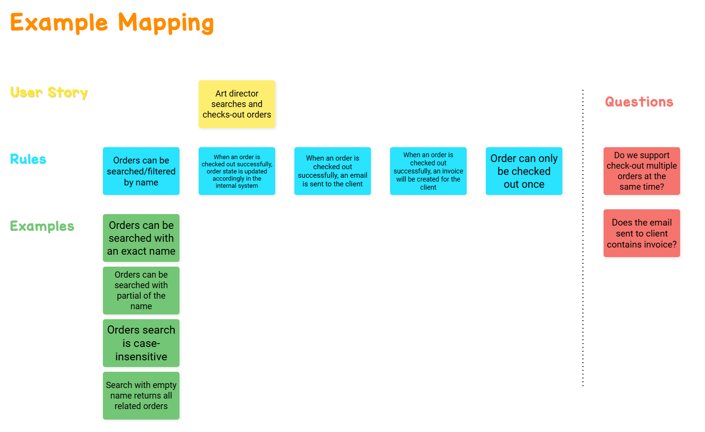

## Progress, thoughts & time

### 13/05

Spent around 2 hours.

#### Prepare tools
- Net 9
- Visual Studio Code
    - [Mermaid Chart extension](https://marketplace.visualstudio.com/items?itemName=MermaidChart.vscode-mermaid-chart): We need C4 and probably a few sequence diagrams.

#### Thoughts
-  C4 seems to fit our needs perfectly for this project. We need to describe the system as a whole, the components and relationship between them. We also need to describe our domain models and probably events.
- They seem to adopt BDD. Let's do it that way.

#### Discovery

### 14/05

Spend around 2 hours.

#### Finished with example mapping
We want to focus on business examples. We don't want to have technical or implementation details here. Rules without examples are only have 1 example. It's themselves.

#### It's time for a high level architecture design
Since this service will be developed and maintained by a team of 10-20 engineers, it's crucial to have a good approach for architecture documentation process. We want an always-up-to-date architecture documentation that easy to maintain. My choice is to use [arc42 Template](https://arc42.org/overview) in conjunction with [C4 model](https://c4model.com/).

All the Context/Scope, Deployment view and Building blocks view can be achieved with C4 model diagrams.

We will use [Mermaid](https://mermaid.js.org/syntax/c4.html) to model C4 diagrams.

Benefits of using arc42:
- A new culture of architecture documentation process. It's the whole-team effort. The team responsible for creating and updating the documentation will also be responsible for maintaining its content. That's the best way because they know the best what's the current approaches, what's the reasons lead to changes ... The documentation itself comes along with the code.
- [Architecture decisions](https://docs.arc42.org/section-9/) is part of arc42. It's crucial for maintaining institutional knowledge and understanding why the architecture evolved as it did.

Requires a learning curve, though.

#### Add contents to architecture documentation

#### Will continue focusing on architecture documentation tomorrow. Let's hope we can finish a majority part of it tomorrow.

### 16/05

Around 3 hours.

#### Trying to finish the architecture design so that we can focus on the implementation tomorrow
Finished with important parts of the architecture documentation. Will improve it along with the implementation.
Let's start with the implementation tomorrow.

### 17/05

Around 2 hours

#### Add  project skeleton with a few important endpoints
- Use OpenAPI
- API endpoint are on v1
- Added component test cases for the 2 main functions: Search for order and checkout order

Let's start adding more logic tomorrow.

### 18/05

Around 6 hours.

#### Implement the requirement:
- Added 2 API projects:
    - Pixelz.InternalSystem: To manage orders
    - Pixelz.OrderService: To implement checkout saga

We use EventStoreDB for both order store and saga store for simplification

All components can be run with [docker-compose.yml](./docker-compose.yml)

The main flow for create order, get order and checkout saga has been finished. Only payment gateway has been included into the checkout flow, though. I will implement event listener for InternalSystem tomorrow to listen for checkout saga status changes to demostrate the post-checkout flow.

Code need to be refactored.

Important architecture decisions need to be documented.