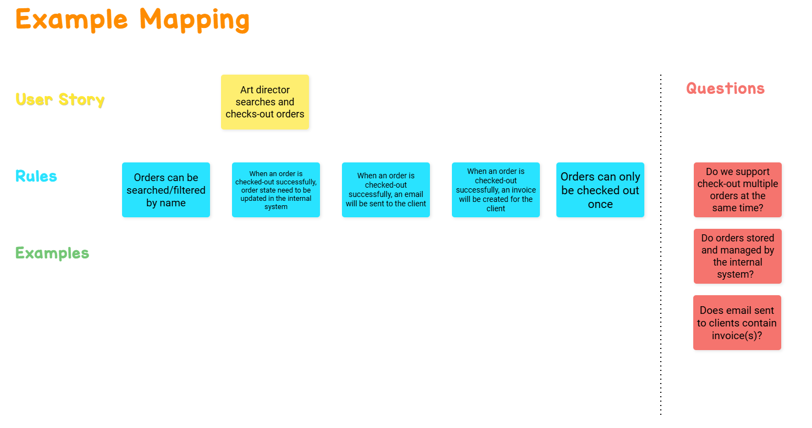

## Progress, thoughts & time

### 13/05

Spent around 2 hours.

#### Prepare tools
- Net 9
- Visual Studio Code
    - [Mermaid Chart extension](https://marketplace.visualstudio.com/items?itemName=MermaidChart.vscode-mermaid-chart): We need C4 and probably a few sequence diagrams.

#### Thoughts
-  C4 seems to fit our needs perfectly for this project. We need to describe the system as a whole, the components and relationship between them. We also need to describe our domain models and probably events.
- They seem to adopt BDD. Let's do it that way.

#### Discovery

Examples tomorrow.
